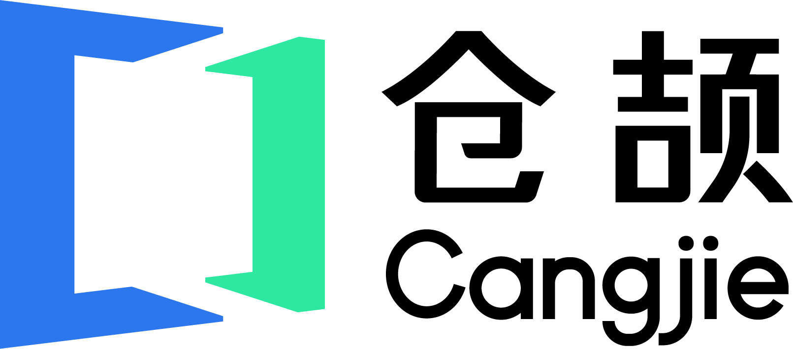

# Cangjie Programming Language Tutorial. 《跟老卫学仓颉编程语言开发》

*Cangjie Programming Language Tutorial*, is a book about how to develop Cangjie applications.

《跟老卫学仓颉编程语言开发》是一本 仓颉编程语言 应用开发的开源学习教程，主要介绍如何从0开始开发 仓颉编程语言 应用。本书包括最新版本  仓颉编程语言 0.53.13 中的新特性。图文并茂，并通过大量实例带你走近 仓颉编程语言 的世界！

本书业余时间所著，书中如有错漏之处，敬请斧正。

有关HarmonyOS应用开发的内容，可以参考《[跟老卫学HarmonyOS开发](https://github.com/waylau/harmonyos-tutorial)》。

## Summary 目录

* [仓颉编程语言开发环境搭建（安装仓颉工具链）](https://waylau.com/install-cangjie-lang/)
* [仓颉编程语言开发环境搭建（安装VSCode仓颉插件）](https://waylau.com/install-cangjie-plugin-in-vscode/)
* [DevEco Studio 5.0.1 Beta3安装及配置](https://developer.huawei.com/consumer/cn/forum/topic/0201167060557489345)
* [HarmonyOS NEXT仓颉编程语言开发环境搭建（安装DevEco Studio Cangjie Plugin）](https://waylau.com/install-deveco-studio-cangjie-plugin/)
* [仓颉开发HarmonyOS，报错error: undeclared identifier 'ViewStackProcessor'](https://developer.huawei.com/consumer/cn/forum/topic/0203168734455974805)
* [仓颉开发HarmonyOS，@Builder 和@Component的区别？](https://developer.huawei.com/consumer/cn/forum/topic/0201168738273407796)
* [仓颉开发HarmonyOS，internal import 和import 有什么区别？	](https://developer.huawei.com/consumer/cn/forum/topic/0201168738630513798)
* [“HarmonyOS NEXT+AI大模型打造智能助手APP(仓颉版)”实战课程简介](https://developer.huawei.com/consumer/cn/forum/topic/0207177697979523118)
* [使用鸿蒙仓颉编程语言开发“Hello World”应用](https://developer.huawei.com/consumer/cn/forum/topic/0208178470222403321?fid=0109140870620153026)
* [实战：猜数字游戏](https://developer.huawei.com/consumer/cn/forum/topic/0208178389310767290?fid=0109140870620153026
)
* [谷歌将 Android OS 转为 “内部开发”，对鸿蒙系统来说是否是个机会？](https://developer.huawei.com/consumer/cn/forum/topic/0204178542373267294?fid=0109140870620153026)
* [【HarmonyOS NEXT+AI】问答01：课程里用的什么大模型？能用DeepSeek吗？](https://developer.huawei.com/consumer/cn/forum/topic/0202179567792367460?fid=0109140870620153026)
* [科技巨头加倍押注生成式 AI](https://developer.huawei.com/consumer/cn/forum/topic/0207179667509011509?fid=23)
* [【HarmonyOS NEXT+AI】问答02：有一点编程基础，可以学不？](https://developer.huawei.com/consumer/cn/forum/topic/0207179750550660521?fid=0109140870620153026)
* [【HarmonyOS NEXT+AI】问答03：找不到DevEco Studio Cangjie Plugin下载链接？](https://developer.huawei.com/consumer/cn/forum/topic/0207180264471291591?fid=0109140870620153026)
* [【HarmonyOS NEXT+AI】问答04：仓颉编程语言适合毕业设计吗？
](https://developer.huawei.com/consumer/cn/forum/topic/0201181154070287038?fid=0109140870620153026)
* [华为首款鸿蒙电脑正式亮相](https://developer.huawei.com/consumer/cn/forum/topic/0202182086290078559?fid=0109140870620153026)
* [【HarmonyOS NEXT+AI】问答05：ArkTS和仓颉编程语言怎么选？](https://developer.huawei.com/consumer/cn/forum/topic/0204182208074587445?fid=0109140870620153026)
* [HarmonyOS NEXT+AI打造智能助手APP（适配DeepSeek）](https://developer.huawei.com/consumer/cn/forum/topic/0201182544745864038?fid=0109140870620153026)
* [华为自研仓颉编程语言将开源，未来与ArkTS同等地位](https://developer.huawei.com/consumer/cn/forum/topic/0210186139141263055?fid=0109140870620153026)
* [【HarmonyOS NEXT+AI】问答06：仓颉编程语言的仓颉工具链和DevEco Studio Cangjie Plugin是什么关系？](https://www.imooc.com/article/382914)
* [仓颉编程语言（Cangjie）正式发布1.0.0 LTS版本，附安装配置教程](https://developer.huawei.com/consumer/cn/forum/topic/0202187267416126149?fid=0109140870620153026)
* [仓颉编程语言（Cangjie）正式发布1.0.0 LTS版本，附安装配置教程](https://www.bilibili.com/video/BV1mz36zMEdz/)（视频）
* [安装仓颉编程语言（Cangjie）1.0.0版本VS Code插件](https://www.bilibili.com/video/BV1DGGszeEK2/)（视频）
* [【HarmonyOS NEXT+AI】问答07：DevEco Studio Cangjie Plugin在哪里下载？为什么看不到？](https://developer.huawei.com/consumer/cn/forum/topic/0201195374935980891?fid=0109140870620153026)
* [Cangjie新作《仓颉编程从入门到实践》简介](https://waylau.com/about-cangjie-programming-language-tutorial-book/)
* 未完待续...

## Samples 示例

* [Hello World](samples/hello_world)
* [变量与常量](samples/variable_demo)
* [函数](samples/function_demo)
* [注释](samples/comment_demo)
* [流程控制](samples/flow_control_demo)
* [猜数字游戏](samples/guessing_game)
* [操作字符串](samples/string_demo)
* [数组类型](samples/array_demo)
* [将包含句号的句子转为单词](samples/convert_sentences_containing_period_into_words)
* [面向对象的图形](samples/oo_for_shape)
* [猜数字游戏（模式匹配）](samples/pattern_match_guessing_game)
* [“剪刀石头布”游戏](samples/rock_paper_scissors)
* [泛型函数](samples/generic_function_demo)
* [泛型结构体](samples/generic_struct_demo)
* [动物发声模拟器](samples/animal_vocal_simulator)
* [使用ArrayList](samples/arraylist_demo)
* [使用HashSet](samples/hashset_demo)
* [使用HashMap](samples/hashmap_demo)
* [名字的漂亮度](samples/the_beauty_of_the_name)
* [throw和处理异常](samples/exception_demo)
* [“剪刀石头布”游戏的异常处理](samples/rock_paper_scissors_with_exception)
* [带传参的名字的漂亮度](samples/the_beauty_of_the_name_with_parameter)
* [读写文件](samples/basic_io_file_demo)
* [获取文件元数据](samples/file_info)
* [使用HashSet](samples/word_frequency)
* [词频统计](samples/word_frequency)
* [删除字符串中出现次数最少的字符](samples/delete_least_occurring_character_from_string)
* [龟兔赛跑](samples/the_tortoise_and_the_hare)
* [‌多窗口售票](samples/multi_window_ticket_sales)
* [‌宏的入门](samples/macro_introduction_demo)
* [‌快速幂的计算](samples/macro_power)
* [‌‌多行dprint宏](samples/macro_muti_dprint)
* [‌创建TCP服务器](samples/tcp_demo)
* [‌创建UDP服务器](samples/udp_demo)
* [‌构建HTTP服务](samples/http_demo)
* [‌构建REST服务](samples/http_rest_demo)
* [‌CJPM入门](samples/cjpm_demo)
* [‌编写仓颉单元测试用例](samples/unittest_demo)
* [‌编写Mocking框架测试用例](samples/unittest_mock_demo)
* [‌统计仓颉编程语言的运行性能](samples/performance_test_of_accumulator)
* [‌实现KV数据库](samples/kv_store)
* [‌实现雪花算法](samples/snowflake_algorithm)
* [‌实现HarmonyOS瀑布流](samples/CangjieHarmonyOSWaterFlow)
* 未完待续...

## Get start 如何开始阅读

选择下面入口之一：

* <https://github.com/waylau/cangjie-programming-language-tutorial> 的 [README.md](https://github.com/waylau/cangjie-programming-language-tutorial/blob/master/README.md) 
* <https://gitee.com/waylau/cangjie-programming-language-tutorial> 的 [README.md](https://gitee.com/waylau/cangjie-programming-language-tutorial/blob/master/README.md) 

## Code 源码

书中所有示例源码，移步至<https://github.com/waylau/cangjie-programming-language-tutorial>的 `samples` 目录下。

## Book 配套书籍、课程

如果你喜欢本开源书，也欢迎支持下该书的正式出版物，实体店及各大网店有售。

* [HarmonyOS NEXT+AI大模型打造智能助手APP(仓颉版)](https://coding.imooc.com/class/927.html)（视频）
* [仓颉编程从入门到实践](https://coding.imooc.com/class/927.html)（北京大学出版社2025年11月出版）

## Issue 意见、建议

如有勘误、意见或建议欢迎拍砖 <https://github.com/waylau/cangjie-programming-language-tutorial/issues>

## Contact 联系作者

* Blog: [waylau.com](http://waylau.com)
* Gmail: [waylau521(at)gmail.com](mailto:waylau521@gmail.com)
* Weibo: [waylau521](http://weibo.com/waylau521)
* Twitter: [waylau521](https://twitter.com/waylau521)
* Github : [waylau](https://github.com/waylau)

## Support Me 请老卫喝一杯

